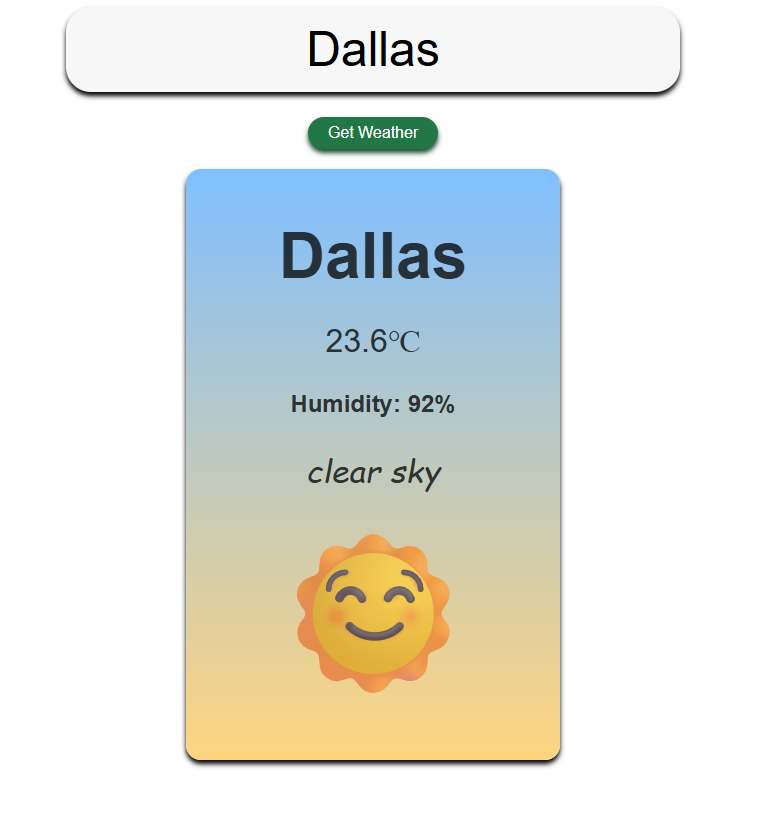

# Weather App

A simple and responsive JavaScript-based Weather App that fetches real-time weather data using the OpenWeatherMap API. Users can enter a city name and get the current temperature, weather condition, and related icon.

---

## Features

- Live weather data using **OpenWeatherMap API**
- Search by city name
- Displays:
  - Temperature (°C)
  - Weather condition (clear, cloudy, rain, etc.)
  - Weather emojis
- Error handling for invalid city names
- Responsive and clean UI

---

## 🛠Built With

- **HTML**
- **CSS**
- **JavaScript**
- **OpenWeatherMap API**

---

## 📸 Screenshot

---

## Preview
[Click here to view the live project](https://yourusername.github.io/weather-app/)  

---
Made with purpose by [@derarshan](https://github.com/derarshan)

ChagaChagaChagaChaga
